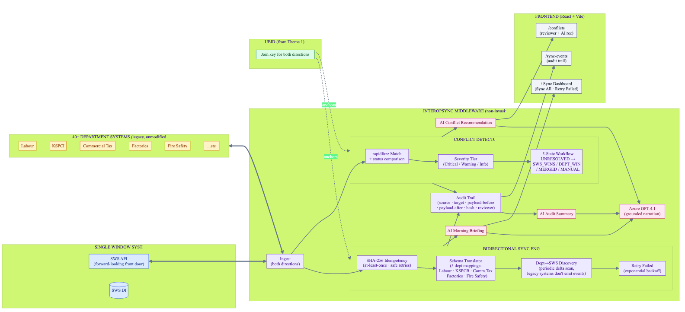

# InteropSync — Two-Way SWS ↔ Department Interoperability Layer for Karnataka

> **PanIIT AI for Bharat 2026 — Theme 2** · **Sponsor:** Karnataka Commerce & Industries (KCI)
> Propagate · Translate · Reconcile

▶ **[Watch the 5-minute demo](https://youtu.be/E1mdO4VJPxs)**

---

## What it solves

Karnataka has a **split-brain problem**. Business registrations live in two competing places — the forward-looking Single Window System (SWS) and 40+ legacy department systems still authoritative for businesses already on their books. A change made on either side does not propagate to the other. Big-bang migration is unrealistic — the GST rollout is the cautionary tale. InteropSync is non-invasive middleware that makes both sides work as one, **without modifying either**.

## Key features

- **Bidirectional sync** — SWS → Dept and Dept → SWS, joined by UBID from Theme 1
- **Schema translation** — 5 department mappings (Labour, KSPCB, Commercial Tax, Factories, Fire Safety) with value transforms
- **Idempotent delivery** — SHA-256 payload hash; retries safe at-least-once
- **Dept → SWS discovery** — Periodic delta scans against department APIs (most legacy systems don't emit events)
- **Conflict detection** — rapidfuzz fuzzy match + status comparison; never auto-overwrites
- **5-state conflict workflow** — UNRESOLVED → SWS_WINS / DEPT_WINS / MERGED / MANUAL
- **AI Conflict Recommendation** — Azure GPT-4.1 suggests a strategy with reasoning; reviewer confirms
- **Full audit trail** — Source payload + translated payload + payload hash on every event
- **Retry Failed** — Exponential backoff for failed syncs

## Architecture



> Source: [`docs/diagrams/architecture.mmd`](docs/diagrams/architecture.mmd) (Mermaid)

## Quick start

### Prerequisites

| Tool | Version |
|------|---------|
| Python | 3.11+ |
| Node.js | 18+ |
| npm | 9+ |

### Backend (FastAPI on port 8001)

```bash
cd backend
python3 -m venv .venv
source .venv/bin/activate         # Windows: .venv\Scripts\activate
pip install -r requirements.txt

# Configure env (optional — without keys, AI falls back to deterministic templates)
cat > .env.local <<'EOF'
AZURE_OPENAI_API_KEY=your_key
AZURE_OPENAI_ENDPOINT=https://<resource>.openai.azure.com/openai/deployments/<deployment>/chat/completions?api-version=2025-01-01-preview
EOF

# Seed demo data + run
python ../demo/seed_demo.py
uvicorn main:app --port 8001 --reload
```

Backend on <http://127.0.0.1:8001>. OpenAPI docs at `/docs`.

### Frontend (Vite on port 5173)

```bash
cd frontend
npm install
npm run dev
```

Frontend on <http://localhost:5173> (proxies `/api` → backend port 8001).


## Demo flow

1. Land on `/` for the **AI Morning Briefing** + KPI strip + bidirectional sync event feed
2. Click **Sync All** → SWS-to-Dept propagation across 5 schema mappings
3. Click **Retry Failed** → exponential backoff re-processes FAILED syncs (idempotent via SHA-256)
4. `/conflicts` — pre-seeded conflicts (2 critical, 4 warnings). Expand a CRITICAL → AI Resolution Recommendation
5. `/sync-events` — full audit trail with payload-before / payload-after / hash / reviewer

> **Demo data:** 10 SWS applications · 30 dept records (3 depts each) · 27 sync events · 6 deliberately-seeded conflicts (2 critical, 4 warnings) · 5 schema mappings

## Tech stack

| Layer | Technology |
|-------|------------|
| Backend | FastAPI + SQLAlchemy 2 + SQLite (PostgreSQL-portable) |
| Frontend | React 18 + Vite + TypeScript + Tailwind + lucide-react |
| Sync engine | rapidfuzz fuzzy match + SHA-256 idempotency hash |
| AI / LLM | Azure OpenAI GPT-4.1 (fully optional with deterministic fallback) |

## Brief non-negotiables met

- ✅ Source systems unmodified
- ✅ UBID is the only join key (anchored to Theme 1)
- ✅ Idempotent + at-least-once delivery (SHA-256)
- ✅ Synthetic data only
- ✅ No hosted-LLM on raw PII (on-prem inference path documented)

---

## Submission

- **Hackathon:** PanIIT AI for Bharat 2026
- **Theme:** 2 — Two-Way SWS ↔ Department Interoperability Layer for Karnataka
- **Video:** https://youtu.be/E1mdO4VJPxs
- **Repo:** https://github.com/sridhar7601/interopsync-karnataka
- **Team:** Sridhar Suresh, Sruthi Krishnakumar
